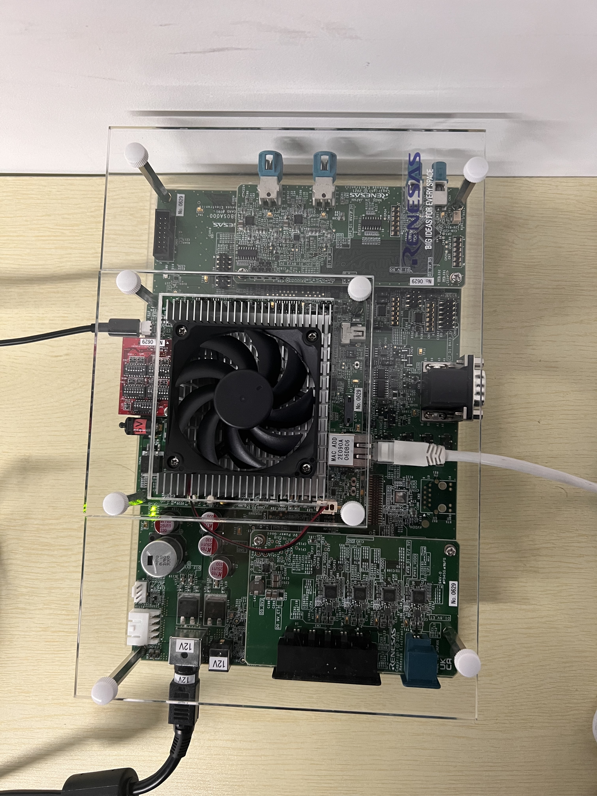

# V4H Setup
 
## official reference

    ..
    ├── system files
    ├── README.md
    ├── demo
    ├── docs
    ├── renesas
    │   ├── RENESAS_RCV3HV3MV4H_YoctoStartupGuide_UME.pdf  # this is the official documentation
    └── tmp

## setup
#### step1
create the tftp server for the v4h to get the necessary file (kernel image + dtb) via ethernet.

  1. **Install tftpd-hpa with sudo privilege**

         $ sudo apt install tftpd-hpa -y

        
     Note: -y flag means to assume yes and silently install, without asking you questions in most cases. Once the installation is complete, you will be able to download files from the TFTP server.
     The default configuration file for tftpd-hpa is /etc/default/tftpd-hpa.
     The default root directory where files will be stored is /srv/tftp
     If you want to upload to the TFTP server, please continue next step.

  2. **Edit tftpd-hpa configuration file**

         $ sudo vi /etc/default/tftpd-hpa

     And change the following line to give R/W permission to TFTP_DIRECTORY folder: 
     [Old] TFTP_OPTIONS="--secure"
     [New] TFTP_OPTIONS="--secure --create"
     and save the file and exit the vi editor.

  3. **Restart the tftpd-hpa service**  
     To make the changes take effect, tftpd-hpa service must be restarted. This can be accomplished by performing the following command.

         $ sudo service tftpd-hpa restart

     At this point you should now have a TFTP server that allows you to both download and upload files.

#### setp2
to boot an embedded system over NFS, an NFS server must be available on the local network. First, we need to install the NFS server. Once the server has been installed, export a directory to use as the root filesystem by setting in /etc/exports file. This document assumes that the root filesystem for the board will be located at /export/rfs on NFS server.
Note: Make sure you are **connected to the internet**. If there is an error, try apt update -y to update your application repository database.

  1. **Install the NFS kernel server package and rpcbind. with sudo privilege**

         $ sudo apt install nfs-kernel-server
         $ sudo apt install rpcbind

     This installs additional packages such as keyutils, nfs-common, rpcbind, and other dependencies required for the NFS server to function as expected.

  2. **Configuring NFS Server**  
     NFS server's shares are configured in the /etc/exports file. Each share takes a list of option names to configure its behavior. Before configuring the NFS server, the following decisions need to be made (and a list of options created) based on the intended use(s) of the NFS share being created:
       * Do NFS clients need the ability to write to the NFS share? If so, it needs to be exported rw. Otherwise, export it as ro
       * If the filesystem will be writeable, is performance or data integrity more important? If performance, async will provide more performance at the risk of lost or corrupt data should the NFS server shut down unexpectedly during a write operation. Otherwise, sync should be used.
       * Is reliability or security more important? If reliability is, use no_subtree_check. Otherwise, use subtree_check.
       * Is user level access control required? If not, getting the NFS server working is much simpler with the no_root_squash option.

     Here is an example of the /etc/exports file that to export the /export/rfs directory to all machines, writeable, with reliability and performance options turned on

         $ sudo vi /etc/exports
     And modify as follow

     **/export/rfs \*(rw,async,no_root_squash)**

  3. **Notify the NFS server after making any changes to the export file**

         $ exportfs -a

  4. **Restart the nfs Service**

         $ sudo service nfs-kernel-server restart
     Now users can configure the client to boot from NFS server.

#### step 3
Prepare filesystem and kernel image + dtb

  1. **Store Kernel image and device tree to TFTP root directory**

         $ cp Image <Device_Tree> /srv/tftp      Linux Host PC

     Note that maybe your TFTP root directory is not like preceding command line shows. And you can just move the file to your own TFTP root directory. Besides, The Image and <Device_Tree> file are in the directory shows following.

         ..
         ├── system files
         │   ├── Image
         │   ├── Image-r8a779g0-whitehawk.dtb
         ├── README.md
         ├── demo
         ├── docs
         ├── renesas
         └── tmp

  2. **Store filesystem (rcar-image-adas-{SoC}.tar.bz2) to root directory of NFS server, and extract it as follows**

         $ cp rcar-image-adas-{SoC}..tar.bz2 /export/rfs $ cd /export/frs
         $ tar xvf rcar-image-adas-{SoC}..tar.bz2

     Note that the file are in the directory shows following.

         ..
         ├── system files
         │   ├── rcar-image-adas-v4h.tar.bz2
         ├── README.md
         ├── demo
         ├── docs
         ├── renesas
         └── tmp

#### Step 4
then we can connect to the V4H board. we use **ethernet cable** to transfer data and **micro usb cable (uart)** as a tty terminal.

  1. **Uart Startup**  
  Connect the cable to the V4H board as follow:
  
     
     For uart software, here we recommend minicom in unix-like OS, but you can also use any other uart software. If you use minicom, this blog (https://blog.csdn.net/houxiaoni01/article/details/124173845) may can help you out. The uart configuration should be set taht:

         Serial Device: /dev/ttyUSB0 (if you only connect one uart device, else you shoud chose the right device on you own)
         baud rate: 921600
         8-bit data
         parity: none
         stop: 1 bit
         flow control: none

     Then toggle the yellow switch to power on the board and you will see the uart software has ouput.
     

  1. **Set U-Boot environment variables**  
  Start U-Boot by board reset. Set and save environment variables in uart tty termial as follows.

         => setenv ethaddr xx:xx:xx:xx:xx:xx
         => setenv ipaddr 192.168.0.20
         => setenv serverip 192.168.0.1
         => setenv bootcmd 'tftp 0x48080000 Image;tftp 0x48000000 <Device_Tree>;booti 0x48080000 - 0x48000000'
     Note: xx:xx:xx:xx:xx:xx is MAC address of Whitehawk, Condor, Eagle board which is printed to the sticker on CN3 port of each board.

  3. **Change the bootargs by U-Boot Save environment variables to persistent storage**  
  To change bootargs which is passed to Kernel command in boot sequence, modify “bootargs” variable of U-Boot. Below command means mounting the root file system as read/write option via NFS server whose IP is 192.168.0.1, root directory is /export/rfs and the client IP is 192.168.0.20

         => setenv bootargs 'rw root=/dev/nfs nfsroot=192.168.0.1:/export/rfs,nfsvers=3 ip=192.168.0.20:::::eth0 cma=560M clk_ignore_unused'
         => saveenv

  
  4. **Start Linux and login**  
  After board reset, U-Boot is started. After countdown, Linux images are loaded, and boot messages are displayed. Finally, you can login with username 'root' and without passward. 

